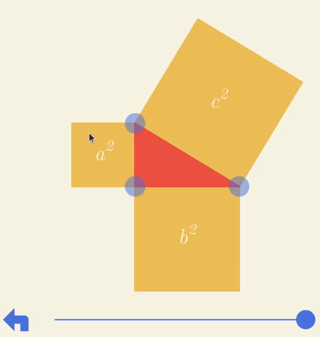

# Overview

Much of this application is conventional.
All components live directly inside of /src, and the following describes each of the directories within /src:

- _assets_: fonts and images
- _hooks_: special-purpose hooks related to drag-and-drop, animations, etc.
- _state_: app-level state management
- _steps_: animation and prose definitions for each step
- _tools_: various utilities, including a special-purpose animation library and a representation of 2D vectors

All graphics are drawn using SVG (really a delight to work with); no knowledge of additional libraries is required to understand the source code.

## An interactive animation

This app combines interaction and animation.
In particular, users can modify the animation itself by dragging points around.
The animations are also "scrubbable": by dragging the slider below each one, any frame can be accessed.

How is this accomplished?



As is often the case, a seemingly complicated problem can be made simple, if looked at from the right point of view.
In our case, this perspective has two parts: a constraint, and an algebraic approach to animation.

### A Constraint

Both the user and the animation itself are in control of certain objects on the screen.
The key is that the draggable objects are not animated, and the animated objects are not draggable.
Were this not the case, there'd be an opportunity for contention: if a user dragged an object to a position different from that intended by the animation, where should the object be rendered?
By animating only non-draggable objects, we avoid this difficulty.

### Animation Combinators

There are many ways to think about animations.
In the context of simulation, we think about _updating_ some value(s) at a regular interval.
While this conception is suitable (and often necessary) for simulation, it's unsatisfactory in our situation.

Instead, we think of an animation as a pure function that, given a frame, produces a value. That is,

```typescript
type Animation = <A>(frame: number) => A;
```

What does this buy us?
For one, representing animations this way gives us "scrubbability" for free: the slider simply picks out a frame, and the app renders that frame by passing it to the appropriate animation function.

But with one small addition, these animations become much more expressive.
Specifically, we'll represent an animation as a _pair_ of things: a function from frames to values, along with a total _duration_.
We represent this pair using a class:

```typescript
class Anim<A> {
  constructor(public fn: (frame: number) => A, public duration: number) {}
}
```

This new representation allows us to sequence animations:

```typescript
class Anim<A> {
  // ...

  then(after: Anim<A>): Anim<A> {
    return new Anim(t => {
      if (t < this.duration) {
        return this.fn(t);
      } else {
        return after.fn(t - this.duration);
      }
    }, this.duration + after.duration);
  }
}
```

We can also execute them in parallel, ease from one value to another, delay for a period of time, and more (see src/tools/Anim.ts for details).
I'm still not quite satisfied with some of the "ergonomics" of the library, but I think it's a step in the right direction.

I'd also be remiss not to mention the excellent article [The Unreasonable Effectiveness of Declarative Programming](https://bollu.github.io/mathemagic/declarative/index.html), in which the author presents a similar set of ideas.

## Debugging, or "where is `cAuxV`?"

Many animations reference points defined in terms of the main right triangle.
We provide "selectors" for each of these points.
Each selector is memoized, so if it's called many times per frame (and some of them are), only the first computation is actually performed.

Unfortunately, I was unable to devise reasonable and memorable names for each of these points.
To remedy the confusion that this might have caused, I created a separate `DebugPoints` component (see src/DebugPoints.tsx) that displays each of the points relative to the main triangle, along with the name I gave it.
To turn on the debug points, simply provide a prop named `debug` to the `Illustration` component (in src/App.tsx):

```typescript
// ...
<Illustration debug />
// ...
```


